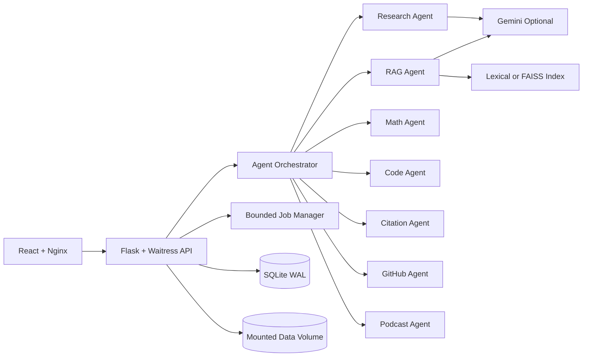

# Scientia.ai


Scientia.ai is a production-minded, multi-agent AI research assistant. It ingests research papers, builds a retrieval index, routes user intent across specialized agents, and returns grounded summaries, answers, equations, citations, GitHub implementations, code scaffolds, and podcast-style briefings.

The project is built to show both product capability and system-design maturity: Docker deployment, persistent storage, background jobs, request tracing, readiness checks, metrics, CI, and a documented scale-out path.

## Highlights

- Multi-agent orchestration for paper analysis, RAG QA, equations, code, citations, GitHub matching, and podcasts.
- PDF ingestion with page-aware chunks, references, markdown export, and persisted document workspaces.
- Source-grounded chat with lexical retrieval by default and optional FAISS/sentence-transformers semantic retrieval.
- Gemini integration with local extractive fallback so demos still work without cloud keys.
- Async PDF processing with bounded in-process jobs, progress polling, retention limits, and `429 job_queue_full` backpressure.
- Operational endpoints for health, readiness, metrics, request IDs, and response timing.
- React dashboard with upload, chat, source panels, agent badges, generated outputs, and settings.
- Docker Compose deployment with Nginx frontend, Waitress backend, and mounted data volume.
- CI and local verification gates for backend syntax, unit tests, smoke checks, and frontend production builds.

## Architecture



More detail:

- [System design](docs/SYSTEM_DESIGN.md): request lifecycle, data model, failure modes, SLOs, and scale-out roadmap.
- [API contract](docs/API_CONTRACT.md): endpoints, request/response shapes, jobs, generated outputs, and operational APIs.
- [Production guide](PRODUCTION.md): deployment, hardening, backups, capacity, and migration path.
- [Internship reviewer guide](docs/INTERNSHIP_REVIEW.md): demo script, tradeoffs, resume bullets, and quality gates.
- [Contributing guide](CONTRIBUTING.md): setup, verification, code standards, and PR checklist.

## Tech Stack

| Layer | Tools |
| --- | --- |
| Frontend | React 18, Tailwind CSS, lucide-react, Nginx |
| Backend | Flask, Flask-CORS, Waitress |
| AI | Google Gemini API, local extractive fallback |
| Retrieval | Lexical vectors by default, optional FAISS + sentence-transformers |
| Data | SQLite WAL, persisted chunks, chats, logs, generated outputs |
| Media | PyMuPDF, PyTesseract, Pillow, gTTS |
| DevOps | Docker, Docker Compose, GitHub Actions CI |

## Quick Start

### 1. Configure Environment

```bash
cp .env.example .env
```

Minimum useful values:

```env
SECRET_KEY=replace_with_a_strong_secret
GEMINI_API_KEY=your_optional_gemini_key
GITHUB_TOKEN=your_optional_github_token
DATABASE_URL=sqlite:////app/data/scientia.db
```

The app runs without Gemini or GitHub tokens, but those features will use local or reduced-capability fallback behavior.

### 2. Deploy With Docker Compose

```bash
docker compose up --build -d
```

Open:

- Frontend: `http://localhost:3000`
- Backend health: `http://localhost:5000/api/health`
- Readiness: `http://localhost:5000/api/system/readiness`
- Metrics: `http://localhost:5000/api/system/metrics`

Stop:

```bash
docker compose down
```

Preserved data lives in the `scientia-data` Docker volume.

## Local Development

Backend:

```bash
cd backend
python -m venv venv
venv\Scripts\activate
pip install -r requirements.txt
python app.py
```

Frontend:

```bash
cd frontend
npm install
npm start
```

## Verification

Backend quality gate:

```bash
python scripts/verify_backend.py
```

Backend syntax, tests, and Flask smoke endpoints:

```bash
python scripts/verify_backend.py --smoke
```

Frontend production build without touching the checked-in working tree:

```powershell
cd frontend
$env:BUILD_PATH="../.codex-test/frontend-build"
npm run build
```

CI runs equivalent backend checks and a frontend production build through `.github/workflows/ci.yml`.

## Core API

| Method | Endpoint | Purpose |
| --- | --- | --- |
| `GET` | `/api/health` | Backward-compatible health and dependency snapshot. |
| `GET` | `/api/system/health` | Detailed health, SLOs, runtime warnings, and scale limits. |
| `GET` | `/api/system/readiness` | Readiness gate for database and storage dependencies. |
| `GET` | `/api/system/metrics` | Queue, rate limiter, and retrieval metrics. |
| `POST` | `/api/upload/pdf` | Upload, parse, chunk, index, and analyze a PDF. |
| `POST` | `/api/upload/pdf?async=true` | Queue PDF processing and return a background job ID. |
| `POST` | `/api/chat` | Orchestrated chat across specialized agents. |
| `POST` | `/api/equation` | Analyze equation text or image. |
| `POST` | `/api/code` | Generate downloadable PyTorch scaffolds. |
| `POST` | `/api/citations` | Extract and analyze citations and related-work themes. |
| `POST` | `/api/github` | Match GitHub repositories to a research topic or links. |
| `POST` | `/api/podcast` | Generate podcast script and optional audio. |
| `GET` | `/api/jobs/{job_id}` | Poll background job status. |
| `GET` | `/api/generated-outputs/{id}/download` | Download generated artifacts. |

See [docs/API_CONTRACT.md](docs/API_CONTRACT.md) for the full API contract.

## Repository Structure

```text
backend/
  app.py                 Flask entrypoint and route wiring
  agents/                Specialized task agents
  routes/                API route registration modules
  services/              LLM, OCR, audio, GitHub, jobs, health services
  utils/                 API helpers, prompts, validators, artifacts
  tests/                 Backend unit tests
  data/                  Runtime data folders tracked with .gitkeep only
frontend/
  src/                   React app
  Dockerfile             Static frontend build served by Nginx
docs/
  API_CONTRACT.md
  INTERNSHIP_REVIEW.md
  SYSTEM_DESIGN.md
scripts/
  verify_backend.py
docker-compose.yml
PRODUCTION.md
```

## Deployment Readiness Checklist

- Set `SECRET_KEY` and restrict `CORS_ORIGINS` before public deployment.
- Keep `.env`, SQLite files, uploads, generated audio/code/markdown, and local build outputs out of Git.
- Run `python scripts/verify_backend.py --smoke` before release.
- Run the frontend production build with a temporary `BUILD_PATH`.
- Confirm `GET /api/system/readiness` returns `200` after deployment.
- Back up the Docker data volume if using SQLite in production.
- Put TLS, authentication, and metrics protection in front of public deployments.

## Scale-Out Roadmap

1. Move SQLite to PostgreSQL with migrations.
2. Move in-process jobs to Redis/Celery, Cloud Tasks, or another durable queue.
3. Move uploads and generated artifacts to object storage.
4. Move rate limiting to Redis or the API gateway.
5. Split retrieval/indexing into worker-owned services.
6. Add authentication, user workspaces, tenant IDs, and authorization checks.
7. Add OpenTelemetry traces and Prometheus-compatible metrics.

## Resume Bullets

- Built a full-stack multi-agent AI research assistant with Flask, React, Gemini, SQLite, RAG retrieval, OCR, TTS, and Docker.
- Designed source-grounded QA over uploaded PDFs with page-aware chunks, lexical/FAISS retrieval modes, and local fallback behavior.
- Added production-style controls including request tracing, readiness/metrics endpoints, bounded async jobs, rate limiting, CI, and deployment docs.
- Documented system architecture, API contracts, SLO targets, failure modes, and a scale-out migration path to production infrastructure.