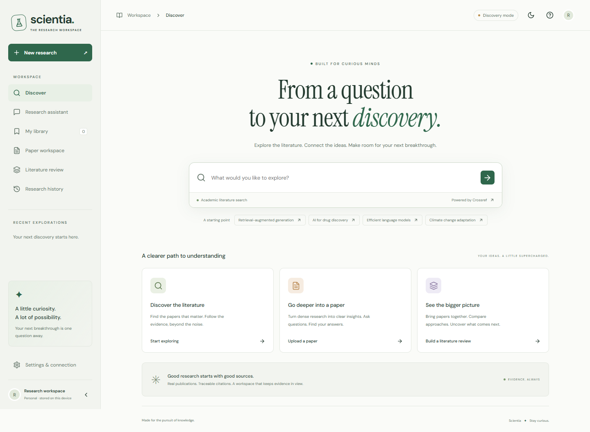
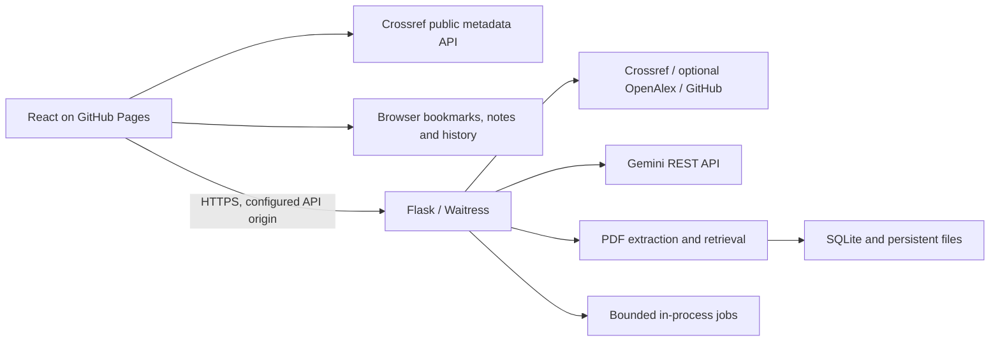

# Scientia — AI Research Workspace

A research assistant for discovering academic publications, organizing evidence, reading PDFs, and building source-backed research conversations and reviews. The React frontend runs on GitHub Pages; a Flask backend preserves PDF processing, Gemini, retrieval, equation, code, citation, GitHub, and briefing tools.

**Live application:** [Open Scientia](https://pruthvi226.github.io/AI_Research_Assistant/). The GitHub Pages frontend is connected to the [free Render backend](https://scientia-research-api.onrender.com). Discovery, PDF extraction and local document chat are available. Gemini generation requires a server-side provider key and remains unavailable until configured.

**Free backend:** Deployed in Singapore using Render's **Free** compute plan without a persistent disk. [Service dashboard](https://dashboard.render.com/web/srv-dbb69tgm7kps73c96rq0). PDFs and backend history are temporary and reset on restarts, redeploys, and idle spin-down. Browser bookmarks and notes remain local. [`render.yaml`](render.yaml) preserves the free configuration for future Blueprint use. Set `GEMINI_API_KEY` only in the backend environment to enable generative features.



<details><summary>Mobile screenshot</summary>


</details>

## Features

| Capability | Static Pages frontend | Connected backend |
| --- | --- | --- |
| Academic discovery | Crossref topic, title, author and keyword search | Server evidence retrieval for AI answers |
| Filtering | Publication year, relevance, newest, citation count, pagination | — |
| Paper metadata | Authors, venue, DOI, abstracts and PDF links when supplied | OpenAlex enrichment for extracted references |
| Personal library | Bookmarks, notes, library filter, search history | Persisted uploaded documents and document chats |
| Citation tools | APA, IEEE, MLA draft citations; BibTeX and text export | Reference extraction from PDFs |
| Research chat | Browser conversation persistence and export | Gemini source-backed multi-turn chat; extractive PDF QA without a key |
| Paper workspace | Responsive document interface | PDF extraction, summaries, methodology, results, limitations, future directions |
| Comparison | Saved-paper selection and metadata table | Abstract-based literature reviews and uploaded-PDF comparison; cross-document QA |
| Additional tools | Markdown/JSON reports and local workspace export | Equation explanation, PyTorch scaffolds, GitHub matching, briefing scripts, optional audio API |

AI analysis, local extraction/templates, and metadata output are labeled separately. Missing provider configuration produces an actionable error; it never fabricates an AI answer. Source metadata is evidence provenance, not independent verification of the paper's claims.

## Stack and architecture

- React 18, Vite, Lucide icons, custom responsive CSS, light/dark themes.
- Lazy-loaded React Markdown and GFM tables; raw HTML is not executed and unsafe links are rejected.
- Flask, Flask-CORS, Waitress, SQLite WAL, PyMuPDF; optional OCR and audio services.
- Gemini REST API with server-side keys, bounded requests, explicit provider errors, and existing extractive fallback.
- Lexical retrieval by default; optional FAISS/sentence-transformers remains available.
- Vitest, ESLint, Playwright, axe, Python unittest, GitHub Actions, Docker, Render Blueprint.


```mermaid
flowchart LR
    Browser[React on GitHub Pages] --> Crossref[Crossref public metadata API]
    Browser --> Local[Browser bookmarks, notes and history]
    Browser -->|HTTPS, configured API origin| API[Flask / Waitress]
    API --> Metadata[Crossref / optional OpenAlex / GitHub]
    API --> Gemini[Gemini REST API]
    API --> PDF[PDF extraction and retrieval]
    API --> Jobs[Bounded in-process jobs]
    PDF --> Storage[SQLite and persistent files]
```

The backend is a **shared portfolio workspace**, not a private multi-tenant service. Upload public papers only. Authentication, user ownership, and authorization across all document/job/artifact endpoints are future requirements for confidential or multi-user production use. Admin routes are protected separately.

## Local development

Requires Node **22.14+** and Python **3.11+**. A lightweight backend install avoids downloading ML models.

From the repository root:

```powershell
Copy-Item .env.example .env
python -m venv .venv
.\.venv\Scripts\Activate.ps1
pip install -r backend/requirements_docker.txt
cd backend
python -m dotenv -f ../.env run -- python app.py
```

Edit `.env` before starting. The example paths work with `backend/` as the working directory and with Docker's `/app` working directory. The backend reads process environment variables; the dotenv command loads the local file explicitly. For a keyless local session, `python app.py` works with default paths. Never commit `.env`.

In a second terminal:

```powershell
cd frontend
npm ci
npm run dev
```

Open `http://127.0.0.1:3000`. Vite proxies `/api` to `http://localhost:5000`. Without a backend, discovery and local library features still work; PDF and AI controls show connection guidance.

For a standalone discovery-only production preview:

```powershell
cd frontend
npm run build
npm run preview
```

## Configuration

| Variable | Where | Purpose |
| --- | --- | --- |
| `GEMINI_API_KEY` | Backend environment only | Enable generative research chat, summaries and comparisons |
| `GEMINI_MODEL` | Backend | Configurable Gemini model; default `gemini-2.5-flash`. Confirm access and availability in your provider account. |
| `GITHUB_TOKEN` | Backend, optional | Higher GitHub metadata quota |
| `OPENALEX_API_KEY` | Backend, optional | Authenticated OpenAlex reference enrichment |
| `SECRET_KEY` | Backend | Strong random production secret |
| `ADMIN_API_KEY` | Backend | Protect administrative routes; never embed it in a frontend build |
| `REQUIRE_ADMIN_AUTH` | Backend | `true` in public hosting; local example uses `false` |
| `CORS_ORIGINS` | Backend | Exact comma-separated frontend origins, e.g. `https://pruthvi226.github.io` |
| `REACT_APP_API_URL` | Frontend build / GitHub repository variable | Public HTTPS backend origin, no trailing API path; blank builds discovery mode |
| `PUBLIC_URL` | Frontend build | Repository base path, set automatically by the Pages workflow |
| `DATA_FOLDER` and storage paths | Backend | Put database, uploads, indices and generated files on persistent storage |

See [`.env.example`](.env.example) and [`frontend/.env.example`](frontend/.env.example). Only the public API origin is embedded by Vite. Production builds never include admin/provider keys. A same-origin Nginx deployment uses `REACT_APP_API_URL=/`; this is distinct from a standalone Pages build.

## Testing

```powershell
python scripts/verify_backend.py --smoke
cd frontend
npm run lint
npm test
npm run build
npx playwright install chromium
npm run test:e2e
npm audit
```

On a system with Chrome already installed, set `$env:E2E_CHROME='true'` to use Chrome. Browser tests run against the production preview server and use deterministic publisher fixtures **only in tests**. They cover discovery, filters, bookmarks, note persistence, comparison selection, downloads, errors, empty states, hash routing, back navigation, themes, keyboard focus, static capability states, and accessibility at desktop/tablet/mobile sizes.

An opt-in live Crossref browser check uses `$env:E2E_LIVE='true'; npm run test:e2e -- live.spec.js`. To reproduce the connected PDF browser test, run `python scripts/make_test_pdf.py`, start an isolated local backend, build with `REACT_APP_API_URL` pointing to it, then set `E2E_CONNECTED=true` and run `npm run test:e2e -- connected.spec.js`. Keep provider credentials unset for the missing-key assertion. These integration checks are separate from deterministic CI.

GitHub Pages subpath verification on PowerShell:

```powershell
$env:PUBLIC_URL='/AI_Research_Assistant/'
$env:E2E_BASE_PATH='/AI_Research_Assistant/'
npm run build
npm run test:e2e
```

`BUILD_PATH` can point at a fresh local output folder when Windows locks an existing build. Use the same `BUILD_PATH` for build and preview. Tests requiring child processes or SQLite temporary files may require a normal terminal outside a restricted Windows sandbox.

Backend integration tests generate an actual PDF and exercise upload, extraction, document reload, original PDF, retrieval QA, history, Markdown export, code compilation, equations, and briefing scripts. AI success/error paths are tested with isolated provider doubles; an authenticated live Gemini run has **not** been verified because no server credential was supplied.

## GitHub Pages deployment

The published source is [Pruthvi226/AI_Research_Assistant](https://github.com/Pruthvi226/AI_Research_Assistant). The tested workspace changes and the pre-existing remote notebook update are both preserved on `main`.

1. Renew GitHub CLI authentication with `gh auth login` in your terminal. Do not paste a token into chat.
2. Review changes, commit the intended source files, and push to `main` or `master`. Preserve any unrelated work already in your checkout.
3. In repository **Settings → Pages**, set **Source → GitHub Actions**.
4. Optionally set **Settings → Secrets and variables → Actions → Variables → `REACT_APP_API_URL`** to the backend HTTPS origin. It is a public configuration value, not a secret. Leave blank for discovery mode.
5. Run the **Deploy GitHub Pages** workflow. It lints, tests, builds with Pages' actual base path, uploads the static artifact, and deploys using GitHub's official Pages actions.
6. Verify the workflow's returned URL, every navigation tab, an actual Crossref search, and, when connected, PDF upload and chat. Refresh `#library` directly to check routing.

The verified live URL is `https://pruthvi226.github.io/AI_Research_Assistant/`. [Successful Pages deployment](https://github.com/Pruthvi226/AI_Research_Assistant/actions/runs/39264404488). Hash navigation avoids Pages server-rewrite requirements. All build assets and the favicon respect the configured repository path.

Workflow: [`.github/workflows/pages.yml`](.github/workflows/pages.yml). General verification: [`.github/workflows/ci.yml`](.github/workflows/ci.yml).

## Backend deployment

[`render.yaml`](render.yaml) is schema-validated for one Docker web service with `plan: free` and no persistent disk. This configuration is intended for a portfolio demo. [Render free-plan limits](https://render.com/docs/free) include idle spin-down and loss of runtime files; cold starts can take about a minute.

1. Push the reviewed source to GitHub, then create a Blueprint from that repository in your chosen Render workspace.
2. Select the Free compute plan. Do not attach a disk or upgrade to a paid plan for this configuration.
3. Set `GEMINI_API_KEY` through Render's secret environment UI. `SECRET_KEY` and `ADMIN_API_KEY` are generated; keep them server-side. Optional provider credentials can be added there too.
4. Set `CORS_ORIGINS` to the exact Pages origin (no repository path). Existing Blueprint configuration uses `https://pruthvi226.github.io`.
5. Deploy and verify `/api/system/readiness` returns HTTP 200. Set the resulting HTTPS service URL as the GitHub `REACT_APP_API_URL` repository variable, then rerun Pages deployment.
6. Verify error handling, upload polling and source links. Verify cloud-backed generation after setting a Gemini key. Expect backend data to reset on restarts; download reports you want to keep.

The Docker entry point honors `$PORT` and generates private runtime secrets if none are configured. Runtime files use `/app/data` on the ephemeral filesystem. In-process jobs do not survive restarts. Durable backend storage would require an explicit future hosting/storage change; this free deployment does not provide it.

For local Docker, `docker compose up --build` serves Nginx on port 3000 and Flask on port 5000. Nginx permits the public Crossref API in its connection policy. Docker has not been executed in this environment.

## Repository guide

```text
frontend/src/App.jsx                 Workspace, routing and research flows
frontend/src/components/PaperCard.jsx Reusable result/bookmark card
frontend/src/components/Markdown.jsx  Lazy-loaded safe report rendering
frontend/src/research.js              Metadata, citations, downloads and search
frontend/src/api.js                   Backend client, validation and job polling
frontend/e2e/                         Production browser checks
backend/app.py                       Flask application and existing API adapters
backend/routes/research_routes.py     Evidence-backed chat and review endpoints
backend/services/research_service.py  Bounded metadata fetches and cache
backend/agents/                      Existing specialized research tools
backend/tests/                       Unit, security and real document-flow tests
docs/IMPLEMENTATION_REPORT.md         Original audit, decisions and limitations
docs/screenshots/                    Captured desktop and mobile UI
```

`backend/app/` is an incomplete older FastAPI scaffold; it is not the running service. `backend/requirements_prod.txt` now installs the Flask runtime instead of the unrelated scaffold dependencies. Some legacy React components remain in source for reference but are not bundled. Pre-existing deleted files were not restored over the user's work.

## Limits and next improvements

- The frontend and free backend are published. Local PDF tools work without a provider key; Gemini generation remains pending a backend credential. Backend storage is temporary on the free plan.
- Gemini is optional for local extraction but required for genuine generative chat/reviews; model/provider failures are shown or labeled as local fallback.
- Crossref coverage depends on publisher deposits. Abstracts, citation counts, and PDF links may be absent; linked full text may be paywalled. Citation formats are drafts to verify before publication.
- Literature reviews use available abstracts, not retrieved full text. Missing methodologies, datasets, metrics, and findings must remain explicitly unreported. Proposed research gaps are hypotheses.
- PDF upload currently supports text PDFs up to 20 MB. Scanned/encrypted/unextractable PDFs produce errors; there is no OCR PDF pipeline. Image OCR requires Tesseract for the existing equation API.
- The browser holds one general conversation, with bounded turns and local export. Document history is persisted by backend workspace. There is no account sync, session archive UI, or private tenant isolation.
- Local code is a generic scaffold, not a reproduction of the paper. Local equation output is a template, not a verified derivation. Review all generated code before running it.
- Audio remains available through the existing API; the UI exposes scripts. Audio generation depends on external TTS and is not live-verified here.
- For private or larger production use: add user authentication and ownership checks, a durable queue, PostgreSQL, object storage, shared rate limiting, retention policies, and telemetry before scaling out.

See the [implementation report](docs/IMPLEMENTATION_REPORT.md), [API contract](docs/API_CONTRACT.md), and [system design](docs/SYSTEM_DESIGN.md).
