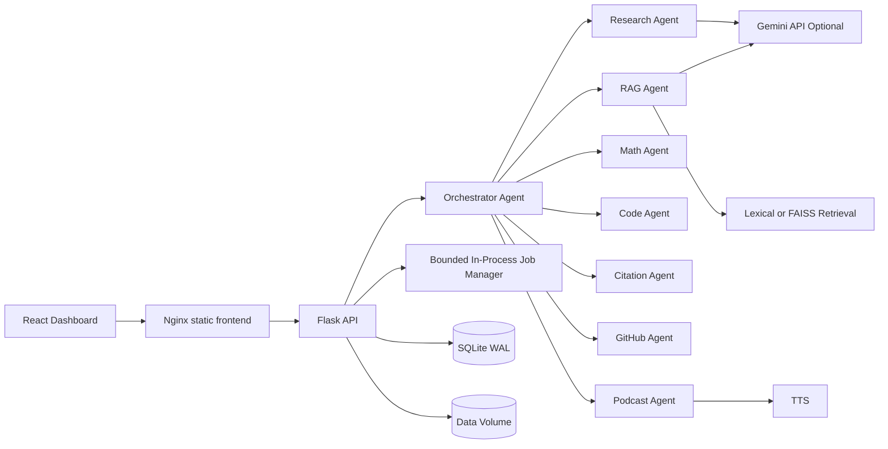
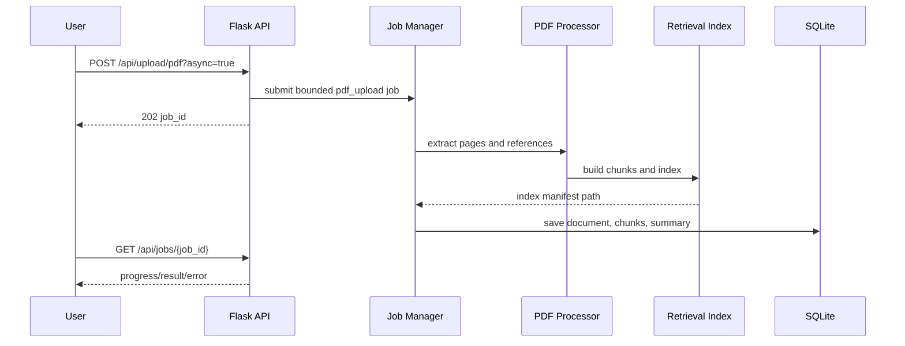
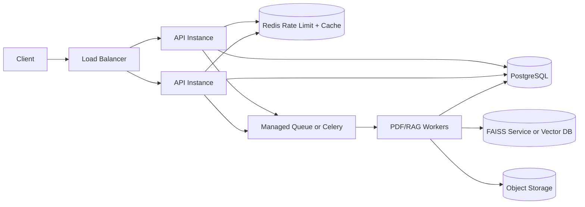

# Scientia.ai System Design

## 1. Product Goal

Scientia.ai is a multi-agent research assistant that turns research papers and related inputs into grounded summaries, QA answers, code scaffolds, citation analysis, GitHub implementation matches, equation explanations, and podcast briefings.

The system is optimized for a strong local/Docker demo today, with clear seams for moving to a distributed production deployment.

## 2. Functional Requirements

- Upload PDF papers and extract text, references, page-aware chunks, and metadata.
- Build a searchable retrieval index for each uploaded document.
- Answer document-grounded questions with source chunks.
- Route user tasks to specialized agents for research analysis, RAG QA, equations, code, citations, GitHub, and podcasts.
- Persist documents, chunks, chats, generated outputs, agent logs, and settings.
- Run long PDF processing asynchronously with progress polling.
- Provide download URLs for generated code, markdown, and audio artifacts.
- Expose health, readiness, metrics, request IDs, and runtime warnings.

## 3. Non-Functional Requirements

| Area | Target |
| --- | --- |
| Availability | Single-node API remains ready when optional Gemini/GitHub dependencies are missing by using local fallbacks. |
| Latency | Health and metadata endpoints should respond under 100 ms locally; chat/RAG latency depends on LLM mode and document size. |
| Throughput | In-process queue is bounded by `JOB_MAX_IN_FLIGHT`; API rate limiting protects local resources. |
| Durability | SQLite and generated artifacts are stored under the mounted data volume. |
| Observability | Every response includes `X-Request-ID` and `X-Response-Time-ms`; system metrics expose queue and rate-limit state. |
| Security | File extensions are validated, downloads are constrained to known artifact roots, CORS is configurable, and production secrets are externalized. |

## 4. Current High-Level Architecture

## 5. Request Lifecycle

1. Client sends an API request.
2. Flask middleware creates or propagates `X-Request-ID` and starts timing.
3. API rate limiting checks the caller key for `/api/*` routes except health/readiness/metrics.
4. Route handler validates request payload and loads document context when needed.
5. Orchestrator classifies the task and invokes the matching agent.
6. Agent calls retrieval, LLM, OCR, audio, GitHub, or persistence services.
7. Database logs chats, agent runs, generated artifacts, and document state.
8. Response middleware attaches request ID and response-time headers.

## 6. Upload And Indexing Flow

The in-process job manager is intentionally simple for local/Docker. It now has explicit limits and metrics, so a production queue can replace it behind the same `submit/get/list/stats` contract.

## 7. Retrieval And RAG Design

- Chunking is page-aware so answers can show source labels.
- Retrieval uses lexical vectors by default to keep local setup fast and deterministic.
- Semantic retrieval can be enabled with `USE_SEMANTIC_EMBEDDINGS=true` when FAISS and sentence-transformers are available.
- The active index is cached in memory and persisted per document under `INDEX_FOLDER`.
- RAG answers use Gemini when configured and local extractive fallback otherwise.
- Context is bounded by `MAX_QA_CONTEXT_CHARS` to control LLM prompt size.

## 8. Data Model

| Table | Purpose |
| --- | --- |
| `documents` | Uploaded papers, text cache, JSON summary, references, and filepath. |
| `chunks` | Page-aware chunk records and metadata for retrieval/source display. |
| `chat_history` | Ordered per-document conversation memory. |
| `chats` | Agent chat log for dashboard/history views. |
| `agent_logs` | Routing and execution audit trail. |
| `generated_outputs` | Code, markdown, audio, equation, and podcast artifacts. |
| `settings` | Runtime settings such as saved Gemini key. |

SQLite WAL is acceptable for a single-node demo. PostgreSQL is the recommended migration when concurrent users, multi-instance APIs, or row-level security become required.

## 9. Backpressure And Capacity Controls

- `RATE_LIMIT_PER_MINUTE` and `RATE_LIMIT_WINDOW_SECONDS` protect API routes from burst traffic.
- `JOB_WORKERS` controls concurrent background processing.
- `JOB_MAX_IN_FLIGHT` caps queued plus processing jobs.
- `JOB_RETENTION_LIMIT` prevents finished job metadata from growing unbounded.
- `MAX_UPLOAD_MB`, `MAX_ANALYSIS_CHARS`, and `MAX_QA_CONTEXT_CHARS` cap expensive inputs.

## 10. Observability

| Endpoint | Use |
| --- | --- |
| `GET /api/health` | Backward-compatible health plus dependency snapshot. |
| `GET /api/system/health` | Dependency checks, SLO targets, scale limits, runtime warnings. |
| `GET /api/system/readiness` | Readiness gate for database and storage dependencies. |
| `GET /api/system/metrics` | Queue, rate limiter, and retrieval state counters. |

Every API response includes:

- `X-Request-ID`: caller-provided or generated request correlation ID.
- `X-Response-Time-ms`: server-side request duration.

## 11. Failure Modes

| Failure | Behavior |
| --- | --- |
| Missing Gemini key | System stays available with local extractive fallback. |
| Gemini request fails | Agent falls back to local answer path when available. |
| Queue saturated | Async upload returns `429 job_queue_full`. |
| Missing document | API returns `404` with a JSON error. |
| Missing artifact file | Download endpoint falls back to stored content when possible. |
| Missing storage/database | Readiness returns `503`. |

## 12. Security Model

- Secrets are read from environment variables or runtime settings, not committed to code.
- Uploads validate file extension and use secure filenames.
- Generated artifact downloads resolve paths and allow only configured artifact roots.
- CORS origins are configured with `CORS_ORIGINS`.
- Production deployments should terminate TLS at the edge, add auth, and protect metrics/settings routes.

## 13. Production Scale-Out Plan

Migration order:

1. Move SQLite to PostgreSQL with migrations.
2. Move in-memory jobs to Redis/Celery, Cloud Tasks, or another durable queue.
3. Move generated artifacts and uploads to object storage.
4. Move rate limiting to Redis or API gateway policy.
5. Split retrieval/vector indexing into a worker-owned service.
6. Add auth, tenant/workspace IDs, and row-level authorization.
7. Add OpenTelemetry traces and Prometheus scraping.

## 14. Design Tradeoffs

- Flask plus in-process jobs keeps the local project easy to run, but it limits horizontal scaling.
- Lexical retrieval is robust without downloads, but semantic retrieval is more accurate for paraphrased questions.
- SQLite WAL is excellent for a portfolio/demo deployment, but PostgreSQL is better for multi-user production.
- Optional cloud LLM behavior improves demo resilience, but quality varies between Gemini and local fallback modes.